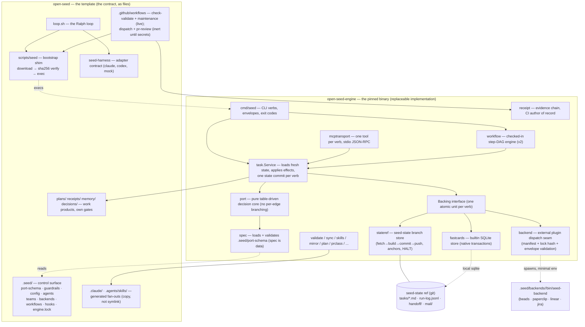
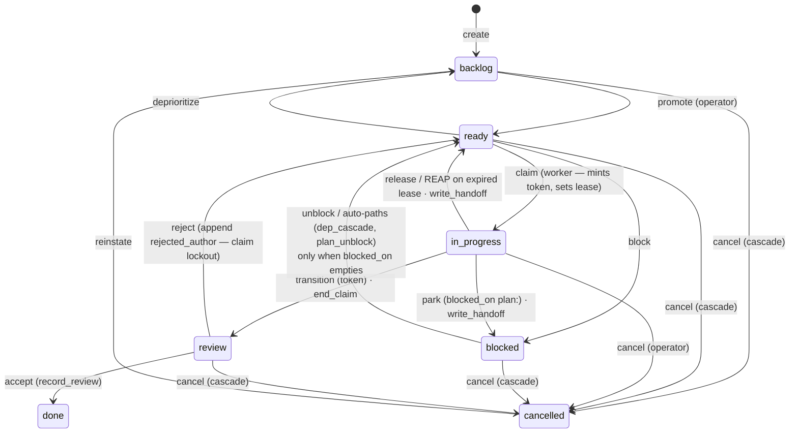
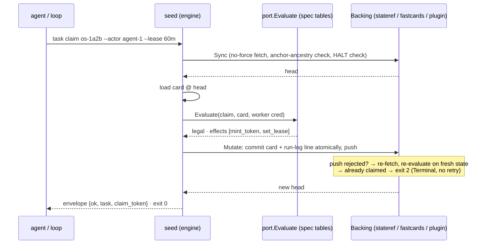

# open-seed — Architecture map

> The map of the whole system across both repos: what each layer is, which file
> is authoritative, and where the gates ground. The [design doc](design-options.md)
> is the *why* — the binding decisions, the glossary, the risks. This file is
> *where things live and how they connect*. Keep the two in sync: when a
> decision changes the shape, update this map in the same PR. On disagreement,
> the design doc wins — this file is navigation, not authority.

**The bet, in one line:** the orchestration contract is checked-in files
(schemas, a transition table, a guardrail policy, a hook contract, CI gates), and
the protocol engine is a pinned, hash-verified, replaceable Go binary that
implements that spec. A clone with no engine installed is still a working repo —
cards are readable markdown, CODEOWNERS and CI still gate merges (design §1,
§7.5 degradation guarantee).

## 1. The two repos

| | `open-seed` (this repo) | `open-seed-engine` |
|---|---|---|
| What it is | the template, instantiated | the `seed` binary |
| Content | the contract as files: `.seed/port-schema/` (states, transition table, exit codes), guardrails, roles, teams, backends, hooks, CI, the loop | the implementation: table-driven port, claim/lease/fence, state-ref store, SQLite fastcards store, backend plugin seam, receipt verification, workflow engine, MCP transport, validators, fan-out sync |
| Changes via | reviewed PRs; the control surface is CODEOWNERS-protected, never auto-mergeable | release pipeline (goreleaser matrix, `checksums.txt`, build-provenance attestations); consumers pin it in `.seed/engine.lock` |
| Authority | the contract | a replaceable implementation of the contract. "Spec is data": the engine contains no hand-written transition branching — editing the spec JSON changes behavior with no code change |

Distribution and pinning:

- `scripts/seed` (POSIX sh; `scripts/seed.ps1` is the Windows twin) is the
  bootstrap shim: read version + SHA-256 from `.seed/engine.lock`, download the
  release asset to a cache **outside** the repo, verify the hash, exec. The
  engine binary is never committed.
- Air-gapped: a `vendor <path>` line in the lock, or `SEED_ENGINE=<path>`.
- Upgrade: `seed upgrade` resolves a release, verifies its checksums, preflights
  protocol compatibility (an incompatible release is refused before anything is
  written), and rewrites the lock — it never touches git, because the lockfile
  is control surface and the bump is a reviewed PR. `seed template upgrade`
  does the pull-based three-way merge for the template itself.
- Protocol-version mismatch (`.seed/version` vs the spec) is exit 10, enforced
  at the shim. CLI usage errors exit 64 (EX_USAGE) so they can never be
  mistaken for port results.

## 2. Layering — who may talk to what

The load-bearing rule (design §7.1): **nothing but the port invokes a
backend.** Scripts, hooks, CI workflows, agent instructions, and the MCP
surface all go through `scripts/seed task <verb>` — the only code that ever
touches a store.

The **Backing** interface is the store boundary: `Sync()` returns a head,
`ReadFile`/`ListDir` read at that head, and `Mutate(checkHalt, build)` runs the
fetch→build→commit→push loop where `build` re-reads fresh state each attempt
and may return a `*Terminal` to refuse without retry (contention, fencing,
invalid transition — all decided on fresh state). Three implementations:

1. **stateref** — the `seed-state` git branch (the filecards backend's store).
2. **fastcards** — a local SQLite DB (path-keyed, same layout as the state ref,
   so card parsing/effects/lint are reused unchanged), one `BEGIN IMMEDIATE`
   transaction per verb, claims genuinely atomic.
3. **backend plugins** — external executables behind the same port, dispatched
   through the seam in `internal/backend`: manifest (`backend.toml`) + lock-hash
   verification **before every invocation**, minimal environment (PATH, HOME,
   the manifest's `requires_env`), stdout validated against the envelope
   contract — plugin output is untrusted input; schema-invalid output is
   discarded with exit 10. A plugin with no lock entry is refused.

## 3. The task port — the protocol

States: `backlog, ready, in_progress, review, done, blocked, cancelled`. The
complete edge table lives in `.seed/port-schema/transitions.json` **as data** —
every legal transition appears exactly once with exactly one verb class and its
spec-declared effects. The engine refuses anything not in it (exit 3); it never
coerces.

**Claim / lease / fence** (design §7.1):

- `claim` is synchronous and push-wins: the claim commit is pushed **inside**
  the verb; a push rejection re-fetches and re-checks, and the loser exits 2
  before any work begins — no half-built worktrees.
- The claim mints a `claim_token`; every later **worker** verb must present it.
  A reaped predecessor's late write gets exit 6 (fenced out).
- Leases are mandatory on filecards (default 60m); the loop renews at
  half-lease cadence. Maintenance **reap**s an expired lease as a *release, not
  a rejection* — `rejected_authors` untouched, a handoff stub written to
  `handoff/<id>.md` on the state ref.
- Verbs are classed: **worker** (fenced, claimant-only) vs **operator**
  (accept/reject/cancel/unblock/close/promote/…) — roster-checked against
  `.seed/config.toml [operators]`. `close` is the composite accept +
  blocker-cascade, valid only from `review`, fired by maintenance only after a
  *merged* PR with a green verify check — dependents never build on unmerged
  work.
- An unplanned card: claiming it authorizes **planning only**; the planner
  parks it `blocked on plan:<pr>` after opening the plan PR. `blocked` cards
  are unclaimable, so no rival planner starts while review is pending.

Port exit codes are part of the contract (`.seed/port-schema/port.json`):
`0` ok · `2` contention/rejected-author · `3` invalid transition · `4` not
found · `5` backend unavailable · `6` fenced out · `10` protocol-version
mismatch · `64` usage.

## 4. State, integrity, and backends

Machine-written coordination state lives on the **`seed-state` ref** — never
checked out, written only by the port shim, one commit per verb (card mutation +
its run-log event line atomically). Layout: `tasks/<id>.md`, `run-log.jsonl`,
`handoff/`, `mail/`.

Integrity posture, stated honestly (design R10): **push-access-deep, not
cryptographic** — anyone who can push `seed-state` can bypass the shim. The
mitigations: no-force-push / no-delete branch rule; the shim treats an observed
non-fast-forward rewrite as an incident (halt + escalate, never silently
adopt); `seed-anchor/<ts>` checkpoint tags (create-only, protected) whose
ancestry is verified on **every** sync; a `HALT` marker at the ref root refuses
mutating verbs until a human runs `seed state resume`; the maintenance
**conformance lint** replays the ref against the transition table and HALTs on
tampering. The load-bearing gates deliberately ground *elsewhere* — merged
plans, CI-regenerated receipts, server-attributed reviews (design §7.2).

Backend table (capability manifest in each `backend.toml`; declared variances
in each README):

| Backend | Entry | Atomic claim | Portability | When |
|---|---|---|---|---|
| **filecards** (default) | builtin | emulated (push-wins, exit 2) | travels with the repo | the default; offline-native |
| **fastcards** | builtin (SQLite) | native | **machine-local** | one machine hammering the loop; linked worktrees share one DB via `--git-common-dir`; the close lane is local — CI never sees the cards |
| **beads** | plugin | native | replicated | multiple writers across machines |
| **paperclip** | plugin | server-DB atomic | server is truth | native **hard budget stops** (the enforcement a repo alone can't provide); no offline, no fork portability |
| **linear / jira** | plugin | emulated, declared | the team's tracker | teams already living in a tracker |

Switching is a reviewed config line **plus the state move**: `seed state export`
→ flip `backend =` in `.seed/config.toml` → `seed init` → `seed state import`
(ids, states, dep edges, rejections, and the run log travel; import refuses a
non-empty target) → `seed backend verify <name>`.

GitHub Issues is a **component, not a backend**: the one-way mirror
(`[mirror] enabled` in config) renders card state to issue labels; label edits
on issues are *requests*, never state.

## 5. The evidence chain (above L1)

**card → gated plan → implementation → CI-verified receipt** — all diffable
files, with the merge-base, never a working-tree copy, as the trust root
(design D3/D4.5):

```mermaid
flowchart LR
    C["card (state ref)<br/>untrusted work order"] -->|claim — unplanned card<br/>authorizes PLANNING ONLY| P1["plan PR<br/>seed/&lt;id&gt;-plan<br/>touches ONLY plans/&lt;id&gt;.md"]
    P1 -->|review + merge| MB["merge-base blob<br/>= the approved plan<br/>(sha256 pinned)"]
    MB --> P2["task PR<br/>seed/&lt;id&gt;<br/>NEVER touches plans/**"]
    P2 -->|implementer generates| R1["receipts/&lt;id&gt;.json<br/>local = advisory claim"]
    R1 --> CI["CI verify (author of record)<br/>regenerates from the merge-base plan,<br/>re-runs Validation Commands,<br/>purity + stale-plan + receipt match"]
    CI -->|green required check| M["merge (server gates:<br/>branch protection + CODEOWNERS<br/>+ D4.5 reviewer ≠ implementer)"]
    M --> CL["maintenance: seed task close<br/>accept + blocker-cascade"]
    CL --> D["done · dependents auto-ready"]
```

The rules that make it checkable:

- **PR purity (D3)**: plan PRs touch exactly one plan file; task PRs touch no
  `plans/**` at all — a task PR burying an edit to another task's plan would
  launder plan tampering through an unrelated review. CI classifies by head
  branch and *fails* on class violation.
- **Stale-plan**: `seed receipt verify` fails when the merge-base plan blob
  differs from the plan blob at the current default head — a superseded plan is
  revocable; amending means a new plan PR + rebase. Enforced per-PR, not via
  repo-wide "require branches up to date" (R12).
- **No self-verification (D4.5)**: a task PR *missing* its receipt, a
  resolvable approved plan, or a qualifying review **fails**, not skips.
  Locally-written receipts are advisory (the implementer's credentials can
  forge them); above L1, CI regeneration is the truth. Reviewer identity is
  bound to server-attributed facts — a GitHub PR review or a verified
  signature — and must differ from the implementer.
- **No self-approval**: `plans/**` and the control surface can never appear in
  the auto-merge allowlist (the validator enforces the intersection rule).

The receipt records `merge_base`, `head`, `plan_path` + `plan_sha256`,
`diff_files` + `diff_sha256` (the diff excludes `receipts/**`, so committing
the receipt doesn't change its own hash), and the re-run validation commands —
see any `receipts/os-*.json` in this repo for the concrete shape.

## 6. The execution surface

**The loop (`scripts/loop.sh`)** — the squad's degenerate one-member case:
claim the highest-priority planned card → fresh worktree (`.seed/hooks/
post-create.d/` runs, propagating `.worktreeinclude`) → invoke the harness
through the **adapter contract** (`scripts/harness/<name>`: prompt on stdin,
JSON envelope out, exits 0/1/3/124/127; shipped: `claude`, `codex`, `mock`) →
dual mechanical gate: blocking `pre-merge.d/` hooks **and** the merge-base
plan's `## Validation Commands` run green during receipt generation → green:
evidence + `in_progress → review`; red: release with a handoff stub and count
toward the circuit breaker. Dual-gate exit: stop when the ready queue is empty
**and** the last gate was green, or when the breaker trips
(`max_attempts_per_task` consecutive failures; `loop_max_iterations` bounds the
run). Fresh context per task — conversation memory is a liability; files are
the memory (design D2, §2).

**Workflows (v2)** — `.seed/workflows/*.yaml` step DAGs: `depends_on` edges,
`consumes`/`produces` artifact contracts (with JSON Schemas), `when` /
`trigger_rule` branching, loop groups, and `approval | review | checks` gates
(a `review` gate must name a remediation step — re-reviewing an unchanged
implementation is the loop's failure mode). `seed workflow validate --all`
runs the thirteen preflight rules in CI (structure + enumerations; kebab ids;
DAG acyclicity; the prompt XOR; referenced files; artifact closure through
`depends_on`; role closure into `.seed/agents/`; harness+model against the
`[workflows]` registry in `config.toml`; budget sanity; loop requirements;
`{{tokens}}` lint; adapter presence). `seed workflow run <name> --mock` routes
every AI step to `scripts/harness/mock` and records every `run:` without
executing — any workflow proves itself with zero credentials and zero side
effects. Run state (checkpoints, artifacts, gate records) lives under
`<git-common-dir>/seed-runs/<run-id>/` — local, shared across linked worktrees,
never committed. `approval` gates pause until a response file appears +
`--resume <run-id>`; resume re-executes only incomplete steps and refuses a
run whose definition or inputs changed. Steps that mutate task state do it
through `seed task <verb>` like every other caller — the executor adds no side
channel to a backend.

**MCP transport** — `seed mcp serve` exposes one tool per port verb (the
worker set and the operator set) over stdio JSON-RPC (2024-11-05, no SDK
dependency), dispatching through the **identical** task-service path the CLI
uses: same fencing, same transition table, same run-log events, same
envelopes. It is an *additional* transport, never a replacement — `--actor`
stays an asserted argument, operator verbs still check the roster, a HALT
marker refuses mutating tools exactly as it refuses CLI verbs, and JSON-RPC
errors stay reserved for transport faults while port refusals come back as
tool results carrying the exit class. `.mcp.json` ships the registration;
it's inert until a harness loads it.

**Division of labor, stated plainly:** workflows are the *intra-run* DAG one
driver executes; **cards remain the inter-agent coordination layer** (dep
edges + `ready`-gating + the close cascade schedule work across agents
topologically). The loop drives one card at a time; workflows drive one job;
the card graph coordinates the fleet.

**Mail and handoff packets** (v2): inter-agent messages are one
never-rewritten file per message at `mail/<recipient>/<msg-id>.yaml` on the
state ref — trust = push access, like every coordination artifact; no daemon.
Mailboxes are read at natural checkpoints (the loop injects unread mail into
the harness prompt **fenced as untrusted data**, acking only after the
iteration succeeds). `seed handoff generate <id>` renders the bounded
(≤8KB) mechanical continuation packet — card goal/criteria, claim block,
evidence trail, branch/HEAD/dirty-file anchors from git — to
`handoff/<task-id>.md` on the state ref.

## 7. CI lanes and where each gate grounds

| Workflow | State | What it does |
|---|---|---|
| `check-validate` | **live** | `make check` + all validators + fan-out drift + skills `install --frozen` + read-only state lint. On PRs and `merge_group`: the **verify gate** — `seed receipt verify` (purity, stale-plan, regeneration) + D4.5 reviewer-identity check. Re-runs on `pull_request_review` so a post-last-push review can't leave verify stale. |
| `seed-maintenance` | **live** | Deterministic, no model secrets. Order matters: reap expired leases → state-shaped plan-unblock (plan PR merged or closed) → close merged task PRs (only on a **green verify check**) → conformance lint (writes HALT on failure, stops the job before anchoring) → prune acked mail → anchor checkpoint tag → report. |
| `seed-close-no-pr` | **live** | `workflow_dispatch`: the `--no-pr` close path whose actor and run URL are recorded server-side — the done-consistency lint validates against that artifact, never card text. The engine additionally requires the actor in the operator roster. |
| `seed-dispatch` | inert → live with secrets | Label router (`scripts/seed-dispatch-route`, contract-tested in `validate.sh`): `cmd:*` labels map to port verbs with label removal + provenance; mirror-label edits become *requests*, never state writes. |
| `pr-review` | inert → live with secrets | The reviewer lane under its own GitHub App identity; feeds the D4.5 identity check. Activation runbook: handbook §"Activating the agent lanes". |

Local vs server, precisely (design D4, R11): harness hooks and `pre-merge.d/`
are **fast pre-checks running on the implementer's credentials — forgeable by
the agent**. The merge authority is server-side: branch protection + required
checks + CODEOWNERS review, plus the D4.5 identity rule. No surveyed worktree
tool can honor a blocking pre-merge, so CI is the merge authority everywhere;
the per-tool fidelity matrix is declared, never silent (`.seed/hooks/README.md`).

## 8. Trust and degradation

The **degradation ladder** — the same repo works at every rung; each rung only
adds convention, never requirements (handbook §5):

1. Solo human, no engine — cards are readable markdown on the state ref;
   CODEOWNERS and CI still gate PRs; `validate.sh` degrades to a warning.
2. Human + engine — the port verbs, receipts, validators.
3. One agent session — `AGENTS.md` teaches any harness the loop manually.
4. The loop — unattended L2.
5. Squads — add team files as scopes grow (`core` is the degenerate default;
   multi-squad routing activates with the second team file, design §6).
6. External orchestrators — anything that can run a CLI drives the port; TUIs
   and platforms layer on top without changing the contract.

Autonomy tiers (`.seed/guardrails.yaml`): **L1** report-only · **L2**
assisted-in-worktree (the default ceiling: agent implements against an
approved plan, a human merges) · **L3** unattended-with-gates (activates with
the pr-review lane; the reviewer identity must differ from the implementer,
server-attributed). Budgets on the file backend are **advisory circuit
breakers, not hard walls** (R6) — the loop enforces its own caps; hard
org-wide stops need a platform (that's the paperclip/backend seam).

## 9. Engine package map

Where to read the engine (`open-seed-engine`):

| Package | Responsibility |
|---|---|
| `cmd/seed` | CLI dispatch. Every port verb emits one JSON envelope + a port exit code; usage errors exit 64. |
| `internal/spec` | Loads + validates `.seed/port-schema/`; the spec files are the single authority on states, transitions, verb classes, exit codes. Inconsistent spec = fatal, never drives the port. |
| `internal/port` | The pure decision core: verb + card state + credential → legality, exit code, effects. No per-edge branching. |
| `internal/task` | The Service: fresh state → `port.Evaluate` → spec-declared effects → one commit per verb. Operator roster, push-wins claim, cascade, handoff stubs, mail, routing. |
| `internal/stateref` | The `seed-state` store: `Mutate` fetch→build→commit→push with jittered backoff; no-force fetches; anchor-ancestry verification; HALT. |
| `internal/fastcards` | Builtin SQLite store implementing the same `Backing`: one `BEGIN IMMEDIATE` transaction per verb, claims genuinely atomic, machine-local. |
| `internal/backend` | The external-plugin dispatch seam: manifest + lock-hash verification, minimal env, envelope validation of untrusted stdout. |
| `internal/receipt` | The evidence chain: merge-base plan pin, stale-plan check, purity, diff hash excluding `receipts/`, CI regeneration as author of record. |
| `internal/workflow` | The v2 step-DAG engine: thirteen preflight rules, parallel waves, `approval|review|checks` gates, `--mock`, run state under `seed-runs/`. |
| `internal/mcptransport` | One tool per port verb, stdio JSON-RPC, stateless wrapper over the same service path. |
| `internal/sync` | Fan-out by copy (byte-identical, no symlinks): agents → `.claude/agents/`, skills → both harness dirs (local name wins over managed), `rules/` → the AGENTS.md managed block; `--check` fails on drift in CI (R1). |
| `internal/validate` | Lints guardrails (auto-merge intersection), team files (scope overlap, tier ceiling, unique priorities), role variants (body-hash identity — variance in binding, never in craft), plans. |
| `internal/{skills,mirror,plan,prclass,card,config,upgrade,template,gitx,upgrade}` | Skills lockfile install (`--frozen`), one-way issues export, plan grammar, PR class/purity, card model, config, engine-pin upgrade, template three-way merge, thin git wrapper driving **system git** (reuses the user's credential helpers — a deliberate §7.5 choice). |

## 10. Source map — which file answers which question

| Question | Read |
|---|---|
| *Why* is it shaped this way? | [`design-options.md`](design-options.md) — D1–D8, §6 teams, §7 decisions, §8 risks R1–R12, §9 glossary (normative), §10 defaults |
| *What* is built and *when*, with acceptance criteria? | [`build-plan.md`](build-plan.md) |
| How do I run a project on open-seed? | [`handbook.md`](handbook.md) — setup, lifecycle, the loop, guardrails, degradation, scaling |
| How do I contribute to open-seed itself? | [`CONTRIBUTING-AGENTS.md`](CONTRIBUTING-AGENTS.md) — authority order, rules of engagement |
| What may a verb do? (normative) | `.seed/port-schema/{port,transitions,verbs}.json` |
| What is enforced where? | `.seed/guardrails.yaml`, `CODEOWNERS`, `.github/workflows/check-validate.yml` |
| How does a backend declare capability? | `.seed/port-schema/backend.schema.json`, each `.seed/backends/<name>/backend.toml` |
| How do I add a harness? | `scripts/seed-harness` (the adapter contract) |
| What is the worktree lifecycle contract? | `.seed/hooks/README.md` |
| Workflow file format? | `.seed/workflow-schema/workflow.schema.json` |
| Design decisions for the engine itself? | `decisions/` (ADR 0001: engine repo + release channel) |
| The survey evidence behind every decision | [`research/`](research/) (categories) + [`research/inspirations/`](research/inspirations/) (implementation-grade deep dives) |
